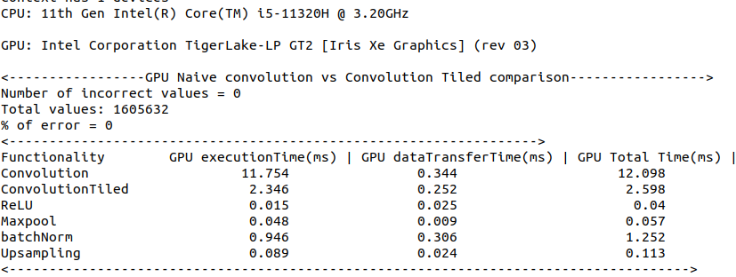
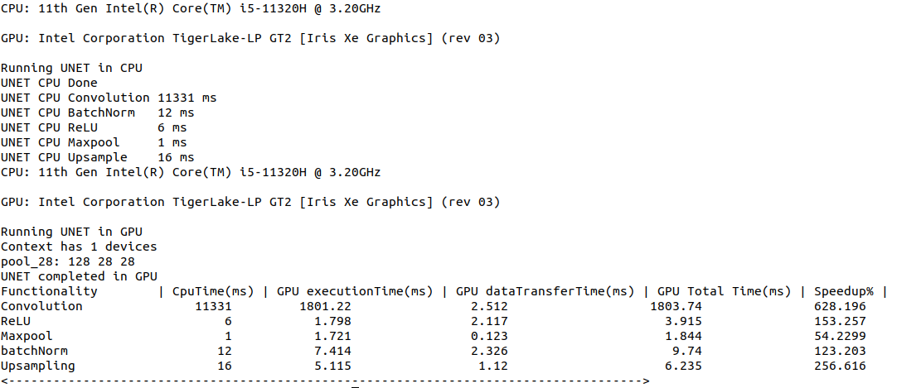
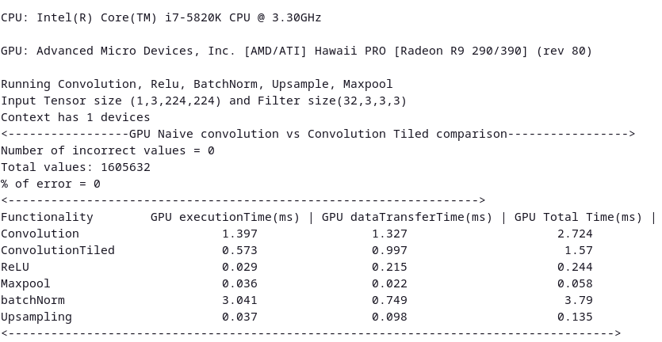
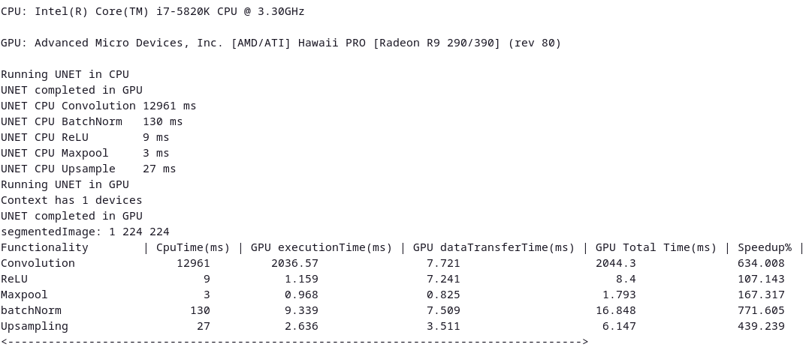
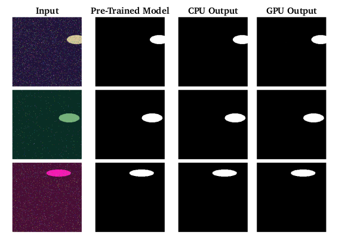

# Conv2D Implementation with OpenCL

This project demonstrates various convolutional neural network (CNN) operations using OpenCL for GPU acceleration. The operations include convolution, ReLU activation, max pooling, batch normalization, tensor concatenation, upsampling and sigmoid activation.

## Features

- Tensor Convolution
- ReLU Activation
- Max Pooling
- Batch Normalization
- Tensor Concatenation
- Upsampling

## Prerequisites

- OpenCL SDK
- OpenCV
- cnpy
- Meson

## Installation of OpenCL in ubuntu 
```console
foo@bar:~$ sudo apt update
foo@bar:~$ sudo apt install intel-opencl-icd
```
## Checking the installation of OpenCL Drivers
```console
foo@bar:~$ clinfo
foo@bar:~$
Number of platforms                               1
Platform Name                                   Intel(R) OpenCL HD Graphics
Platform Vendor                                 Intel(R) Corporation
Platform Version                                OpenCL 3.0 
Platform Profile                                FULL_PROFILE
```
## Installation and Configuration

1. Install the required libraries:

    ```sh
    sudo apt-get install opencl-headers ocl-icd-opencl-dev
    sudo apt-get install libopencv-dev
    sudo apt-get install libboost-all-dev
    sudo apt-get install cmake,meson
    ```

2. Clone the repository:

    ```sh
    git clone https://github.com/raghulrajn/OpenCL
    cd gpu
    ```

3. Clone cnpy:

    ```sh
git clone https://github.com/rogersce/cnpy.git
cp cnpy gpc/src
    ```
4. Download pretrained-kernel from [ZF_UNET_224](https://github.com/ZFTurbo/ZF_UNET_224_Pretrained_Model/releases/download/v1.0/zf_unet_224.h5)
    ```sh
python3 extractWeights zf_unet_224.h5
    ```
    Weights and biases are extracted from the model and will be saved in `pretrainedKernels` folder

## Required final structure
```
├── pretrainedKernels
├── gpu
    ├── lib
    │   ├── Core
    │   ├── lib
    │   ├── OpenCL
    │   └── vx
    ├── src
    │   └── cnpy
    │   ├── conv2d.cl
    │   ├── conv2d.cpp
    ├── meson.build
    ├── run.sh
    ├── results
    ├── sampleImages
    └── utils

```

## Run the code 

```sh
cd gpu
chmod +x run.sh
./run.sh <PATH_TO_IMG NPY FILE>
```
Results after CPU and GPU execution are stored in `results` folder
## Code Structure

- [conv2d.cpp](src/conv2d.cpp): Main source file containing the implementation of Conv2d, Maxpool, Upsampling and UNET operations using OpenCL.
- [conv2d.cl](src/conv2d.cl): Kernel code for all GPU operations
- [pytorch.py](pytorch.py): Python code for convolution, Relu, maxpool etc. Results are stored in npy folder
- [compare.py](compare.py): Python code to crosscheck CPU, GPU and Pytorch results
- [genImage.py](genImage.py): Python code to create sample images for inference. png image and npy file of the same will generated
## Performance comparison
### GPU performance

#### On Intel Iris Xe GPU



#### On AMD GPU



#### Results
