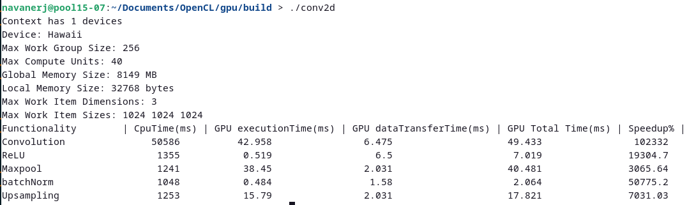

# Conv2D Implementation with OpenCL

This project demonstrates various convolutional neural network (CNN) operations using OpenCL for GPU acceleration. The operations include convolution, ReLU activation, max pooling, batch normalization, tensor concatenation, upsampling and sigmoid activation.

## Features

- Convolution
- ReLU Activation
- Max Pooling
- Mean Calculation
- Variance Calculation
- Batch Normalization
- Tensor Concatenation
- Upsampling

## Prerequisites

- OpenCL SDK
- OpenCV
- cnpy
- Meson

## Installation

1. Install the required libraries:

    ```sh
    sudo apt-get install opencl-headers ocl-icd-opencl-dev
    sudo apt-get install libopencv-dev
    sudo apt-get install libboost-all-dev
    sudo apt-get install cmake,meson
    ```

2. Clone the repository:

    ```sh
    git clone https://github.com/raghulrajn/OpenCL
    cd gpu
    ```

3. Clone cnpy:

    ```sh
   git clone https://github.com/rogersce/cnpy.git
   cp cnpy gpu/src
    ```
## Required final structure
```
├── lib
│   ├── Core
│   ├── lib
│   ├── OpenCL
│   └── vx
├── src
│   └── cnpy
│   ├── conv2d.cl
│   ├── conv2d.cpp
├── meson.build
├── run.sh
└── utils
 ```

## Run the code 

```sh
cd gpu
chmod +x run.sh
./run.sh
```

## Code Structure

- [conv2d.cpp](src/conv2d.cpp): Main source file containing the implementation of Conv2d, Maxpool, Upsampling and UNET operations using OpenCL.
- [conv2d.cl](src/conv2d.cl): Kernel code for all GPU operations

## Performance comparison
### GPU performance

